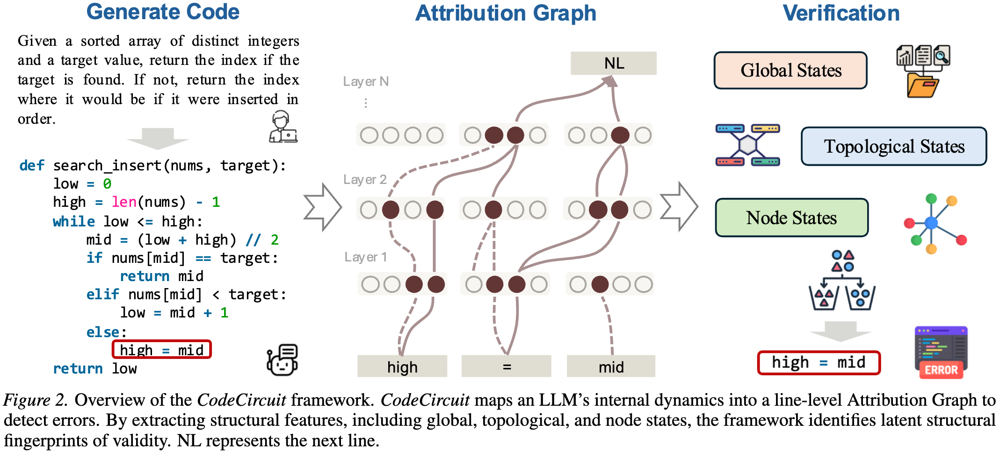

# CodeCircuit 🔍

### Toward Inferring LLM-Generated Code Correctness via Attribution Graphs

> This paper conducts an in-depth investigation into a central question: ​**can code generated by LLMs be evaluated for correctness *without* relying on external assistance**​, such as unit tests or LLM-as-a-judge mechanisms?

> Inspired by mechanistic interpretability, we conduct a series of investigations. **Our key contribution is the demonstration that internal computational structures of LLMs—neural circuits—can serve as indicators of the correctness of generated code.**

> We explore a new avenue for verification and aim to provide insights that may inspire future work, with neural circuits emerging as a direction worthy of attention.

---

# Abstract

Current paradigms for code verification rely heavily on external mechanisms—such as execution-based unit tests or auxiliary LLM judges—which are often labor-intensive or limited by the judging model's own capabilities. This raises a fundamental, yet unexplored question: Can an LLM's functional correctness be assessed purely from its internal computational structure? Our primary objective is to investigate whether the model’s neural dynamics encode internally decodable signals that are predictive of logical validity during code generation. Inspired by mechanistic interpretability, we propose to treat code verification as a mechanistic diagnostic task, mapping the model's explicit algorithmic trajectory into line-level attribution graphs. By decomposing complex residual flows, we aim to identify the structural signatures that distinguish sound reasoning from logical failure within the model’s internal circuits. Analysis across Python, C++, and Java confirms that intrinsic correctness signals are robust across diverse syntaxes. Topological features from these internal graphs predict correctness more reliably than surface heuristics and enable targeted causal interventions to fix erroneous logic. These findings establish internal introspection as a decodable property for verifying generated code.

<p align="center">
    
</p>


# Requirements


Our code is based on [circuit_tracer](https://github.com/safety-research/circuit-tracer). So you just need to install requirements based on [circuit_tracer](https://github.com/safety-research/circuit-tracer). And some extracted feature functions are similar to [CRV](https://github.com/facebookresearch/CRV/blob/main/features/feature_extraction.py)


# Run CodeCircuit 🚀
Our codebase is clearly structured. Under the `data/` directory, the scripts can be executed sequentially in order from 0 to 5.
```
python 0_generate_response.py  # generate code from LLMs
```
Simply run the scripts in order using `python x.py`.

# Citation

If you find our works helpful, please cite

```bibtex
@misc{he2026codecircuit,
      title={CodeCircuit: Toward Inferring LLM-Generated Code Correctness via Attribution Graphs}, 
      author={Yicheng He and Zheng Zhao and Zhou Kaiyu and Bryan Dai and Jie Fu and Yonghui Yang},
      year={2026},
      eprint={2602.07080},
      archivePrefix={arXiv},
      primaryClass={cs.SE},
      url={https://arxiv.org/abs/2602.07080}, 
}
```
If you have any questiones. Feel free to reach out!
